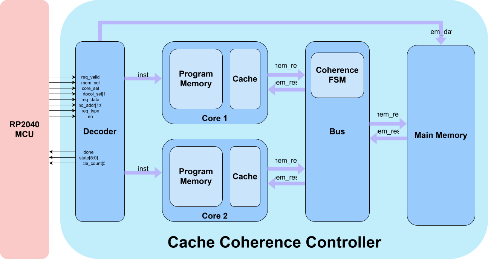

# Cache Coherence Controller Project Proposal

## Statement of Purpose

The Cache Coherence Controller implements one of the MSI, MESI, or MOESI cache coherence protocols and models its behaviour by emulating read and write memory transactions over a shared bus. The coherence protocol is configured by the I/O pins, allowing each protocol's performance to be compared.

## System Diagram

## Pinout

### Inputs

- `req_valid = ui_in[0]`: Input data from MCU valid
- `mem_sel = ui_in[1]`: Memory select
- `core_sel = ui_in[2]`: Core select
- `protocol_sel[1:0] = ui_in[4:3]`: Cache coherence protocol selection
- `req_data = ui_in[5]`: MCU request data
- `req_addr[1:0] = ui_in[7:6]`: MCU request address
- `req_type = uio_in[0]`: MCU request type
- `en = uio_in[1]`: Begin program execution 

### Outputs

- `done = uo_out[0]`: Program done
- `state = uo_out[6:1]`: Cache state after program is finished
- `cycle_count = uio_out[7:2]`: Program cycle count

## Specifications

- Bus uses round-robin arbitration
- 2 cores with their own private cache
    - Each cache has 2 lines
    - Each cache line holds a 2 bit address, 1 data bit, and 3 bits for coherence state
- Each core has its own "program memory" with a capacity of 4 memory instructions
- Memory instructions are a read/write operation with an address and data (only for write operations)
    - A memory instruction has 1 read/write bit, 2 address bits, and 1 data bit
- Main memory has 4 words of data
    - Each word of data is 1 bit
- Cache write policy is write-back

## Timeline

### Design

Deadline: October 22nd

- Create a block diagram and documentation for the microarchitecture outlining how the design is partitioned into RTL modules and how data is passed around the chip (Will and Greg)
    - Cache coherence protocol FSMs will have their own diagrams and timing specifications (Will and Greg)
- Design the logic to initialize main memory and core program memory based on control and data signals from the RP2040 MCU (Greg)

### RTL Implementation

Deadline: November 5th

- Implement the microarchitecture from the documentation in SystemVerilog
- The main functional blocks of the chip are:
    - Decoder (Will)
    - Bus (Will)
        - Round-robin arbitration scheme
    - M(O)(E)SI FSM (Will and Greg)
        - Start with the MOESI FSM design and add additional logic to gate the O and E states based on what protocol is configured
    - Cache Controller (Will and Greg)
        - Handles variable memory latency with ready/valid handshaking (since a cache access is either a hit or a miss)

### Verification

Deadline: November 19th

- Each block will be verified using a combination of directed tests and constrained random verification
- The chip as a whole will also be verified using test programs and checking the cache states after the programs have finished
- Verification will be also be evaluated using functional and code coverage to estimate the extent to which our tests cover the design (ideally 95%+ for both)
- Responsibilities for verification are the same for implementation